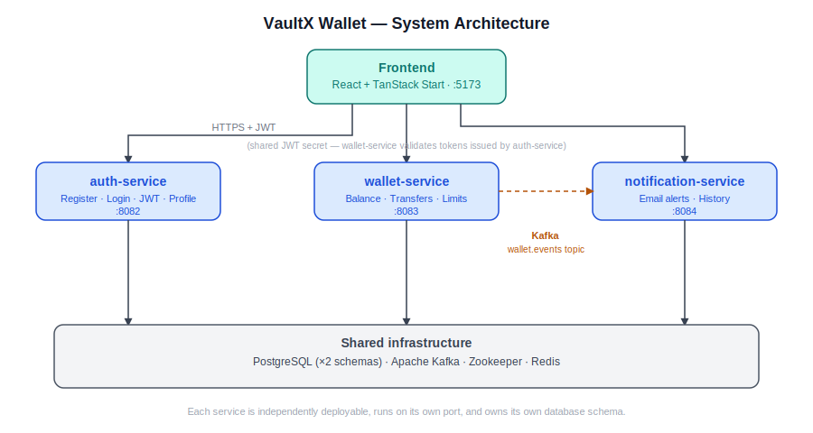

# VaultX Wallet

A digital wallet platform built as three independently deployable Spring Boot microservices behind a React frontend — JWT-secured, event-driven via Kafka, and designed around real-world wallet UX (phone-number-based money transfers instead of raw user IDs, daily/monthly spend limits, simulated payment checkout).

[](https://openjdk.org/)
[](https://spring.io/projects/spring-boot)
[](https://tanstack.com/start)
[](https://kafka.apache.org/)
[](LICENSE)

---

## 🎥 Demo

> *(Replace with your actual video — see "Recording the demo" in the contributing notes, or just drag the file into this section on GitHub and it'll host it inline.)*

[](https://your-video-link-here)

---

## 📐 Architecture



Three services, each with its own database schema, deployed and scaled independently:

| Service | Responsibility | Port |
|---|---|---|
| `auth-service` | Registration, login, JWT issuance, profile management, phone-number-based user lookup | `8082` |
| `wallet-service` | Balance, add money, withdraw, transfers, daily/monthly spend limits, transaction history | `8083` |
| `notification-service` | Consumes wallet events from Kafka, sends HTML emails, stores notification history | `8084` |

`wallet-service` and `auth-service` share a JWT signing secret, so a token issued by `auth-service` is independently verified by `wallet-service` with no synchronous call between them on every request. `notification-service` reacts to events asynchronously over Kafka rather than being called directly — if it's down, money still moves correctly; the user just doesn't get an email until it's back up.

---

## ✨ Key features

- **JWT authentication** with cross-service token verification (shared signing secret, no session calls between services)
- **Phone-number-based money transfers** — senders look up a recipient by phone number and confirm their name before sending, instead of typing a raw user ID
- **Event-driven notifications** — every wallet action publishes a Kafka event; `notification-service` consumes it asynchronously and sends a styled HTML email, decoupled from the request/response cycle
- **Daily & monthly spend limits**, enforced server-side on every withdrawal and transfer
- **Simulated payment checkout** for adding money — a method-selection + processing-state flow rather than instantly crediting an arbitrary typed amount
- **Paginated transaction history** with server-side date-range filtering
- **Notification preferences & history**, independent of the wallet's own data

---

## 🗂 Repository structure

```
vaultx-wallet/
├── backend/
│   ├── auth-service/            # Spring Boot — registration, login, JWT, profile
│   ├── wallet-service/          # Spring Boot — balance, transfers, limits
│   └── notification-service/    # Spring Boot — Kafka consumer, email, history
├── frontend/                    # React + TanStack Start client
├── infra/
│   └── init-db/                 # Postgres init script (creates the 3 databases)
├── docs/
│   ├── architecture.svg
│   └── screenshots/
├── docker-compose.yml           # One command brings up everything
├── .env.example
└── README.md
```

---

## 🚀 Getting started

### Option A — Docker Compose (recommended, one command)

```bash
git clone https://github.com/<your-username>/vaultx-wallet.git
cd vaultx-wallet
cp .env.example .env        # then fill in real values — see below
docker compose up --build
```

This brings up Postgres, Kafka, Zookeeper, Redis, and all three Spring Boot services. Then, separately, run the frontend:

```bash
cd frontend
bun install
bun run dev
```

### Option B — Run each service manually (what I actually used during development)

1. Start infra: `docker compose up postgres kafka zookeeper redis`
2. Run `auth-service`, `wallet-service`, `notification-service` each via your IDE (IntelliJ run configs, or `mvn spring-boot:run` in each folder) — in that order
3. Run the frontend: `cd frontend && bun install && bun run dev`

### Environment variables

Copy `.env.example` to `.env` and fill in:

| Variable | Used by | Notes |
|---|---|---|
| `POSTGRES_PASSWORD` | all 3 services | local Postgres password |
| `JWT_SECRET` | `auth-service`, `wallet-service` | must be identical across both — `wallet-service` verifies tokens `auth-service` issues |
| `MAIL_USERNAME` / `MAIL_PASSWORD` | `notification-service` | a Gmail **App Password**, not your real account password ([how to generate one](https://support.google.com/accounts/answer/185833)) |

`.env` is gitignored — it will never end up in this repo.

### Health checks

Each service exposes a health endpoint, useful for confirming everything's actually up before testing the frontend:
```
GET http://localhost:8082/api/users/health
GET http://localhost:8083/api/wallet/health
GET http://localhost:8084/api/notifications/health
```

---

## 📡 API overview

<details>
<summary><strong>auth-service</strong> — <code>/api/users/*</code></summary>

| Method | Path | Auth required |
|---|---|---|
| POST | `/register` | No |
| POST | `/login` | No |
| GET | `/me` | Yes |
| GET / PUT | `/profile/{userId}` | Yes (own profile only) |
| GET | `/lookup-by-phone?phoneNumber=` | Yes |
| POST | `/change-password` | Yes |
| POST | `/forgot-password` / `/reset-password` | No |
| PATCH | `/deactivate/{userId}` | Yes |

</details>

<details>
<summary><strong>wallet-service</strong> — <code>/api/wallet/*</code></summary>

| Method | Path | Auth required |
|---|---|---|
| POST | `/create` | Yes |
| GET | `/balance` | Yes |
| POST | `/add-money` | Yes |
| POST | `/withdraw-money` | Yes |
| POST | `/transfer` | Yes |
| GET | `/transactions?page=&size=` | Yes |
| GET | `/transactions/date-range?startDate=&endDate=` | Yes |

All wallet-service requests require both an `Authorization: Bearer <jwt>` header and an `X-User-Id` header — the server independently verifies they refer to the same user before processing the request.

</details>

<details>
<summary><strong>notification-service</strong> — <code>/api/notifications/*</code></summary>

| Method | Path |
|---|---|
| GET / POST / PUT | `/preferences/{userId}` |
| GET | `/history/{userId}?page=&size=` |
| GET | `/history/{userId}/date-range?startDate=&endDate=` |

</details>

---

## 🛠 Engineering notes — problems solved along the way

A few decisions and bugs worth calling out, since they're a better signal of how this was built than the feature list above:

- **Recipient lookup, not raw IDs.** Early versions of the transfer flow required typing the recipient's literal `userId` — unrealistic for any real wallet UX. Redesigned it so the sender enters a phone number, the backend resolves it server-side, and the frontend shows a confirmation card with the recipient's name before any money moves.
- **Cross-service date filtering bug.** The transaction date-range filter silently returned empty results because the frontend converted local datetime input to a UTC ISO string (`.toISOString()`), while `wallet-service` stores timestamps as naive `LocalDateTime` with no timezone at all — converting through UTC shifted every query by the local UTC offset. Fixed by sending the literal wall-clock value straight through, untouched.
- **CORS had to be added to all three services independently** — Spring Security's `.cors(Customizer.withDefaults())` is a no-op without an explicit `CorsConfigurationSource` bean, and one service had no CORS handling configured at all.
- **Decoupled notification failures from money movement.** Emails are sent from a Kafka consumer, not inline with the transfer request — `notification-service` being slow or down never blocks or fails an actual transfer.

## 🔭 Known limitations / what I'd do differently with more time

- Wallet timestamps are naive `LocalDateTime` rather than `Instant`/UTC — works because frontend and backend currently run in the same timezone, but would need fixing before deploying services to different regions.
- "Add money" is a simulated checkout, not a real payment gateway integration (no real money changes hands) — the natural next step would be Razorpay/Stripe test-mode integration with signature-verified webhook confirmation before crediting.
- Admin-style wallet operations (freeze/suspend/limit overrides) exist in `wallet-service` but require a `ROLE_ADMIN` that nothing currently grants — there's no admin account provisioning flow yet.

---

## 📷 Screenshots

| Dashboard | Send money | Transaction history |
|---|---|---|
|  |  |  |

---

## 🧰 Tech stack

**Backend:** Java 21 · Spring Boot 3.5 · Spring Security · Spring Data JPA · PostgreSQL · Apache Kafka · JWT (jjwt) · Maven
**Frontend:** React · TanStack Start/Router · TanStack Query · TypeScript · Tailwind CSS · shadcn/ui
**Infra:** Docker Compose · Redis · Zookeeper

---

## License

MIT — see [LICENSE](LICENSE).

## Author

[Your Name] — [LinkedIn](#) · [Portfolio](#)
